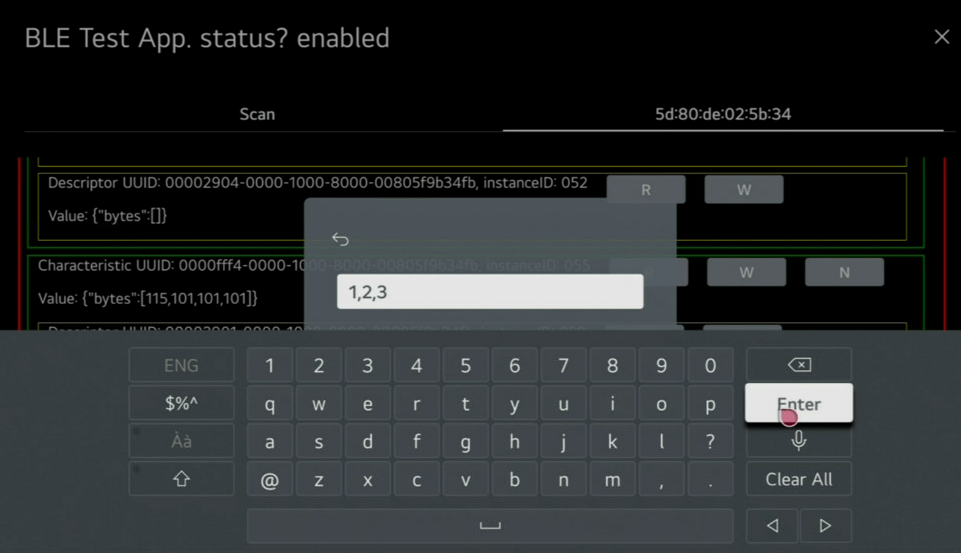

# BLE GATT

The BLE GATT Luan API allows you to use webOS TV's BLE GATT client function. <br/>
This project is a sample app that uses BLE GATT Luna API.

<br/>

## Description

You can find out how to call the luna service API in this project and can check scan, connect, read/write/notify characteristic operation. <br/>
This project visualized the BLE scan, connect read/write/notify characteristic operation from BLE GATT service in this following:

- Show BLE scan results and request to connect target device. <br/><br/>
  <br/><br/>
- You can check the supported services, characteristics, and descriptors of the connected GATT server device. <br/><br/>
  <br/><br/>
- You can set to receive notification from a specific characteristic, and you can read/write a specific characteristic. <br/><br/>
  <br/><br/>
  <br/>

<br/>

## Requirements

- webOS 24 latest version and higher.

<br/>

## How to Use the Samples

### Clone the Repository

Clone the repository and cd into the cloned directory.

```
git clone https://github.com/webOS-TV-app-samples/BLEGATT.git
cd BLEGATT
```

### App Package & Install

enact app build. <br/>
https://enactjs.com/docs/developer-tools/cli/building-apps/#packaging-source-code <br/>

ares package and install on TV. <br/>
https://webostv.developer.lge.com/develop/tools/cli-dev-guide#ares-package <br/>
https://webostv.developer.lge.com/develop/tools/cli-dev-guide#ares-setup-device <br/>
https://webostv.developer.lge.com/develop/tools/cli-dev-guide#ares-install <br/>

```
1. enact app build
npm install
npm run pack -- --production --isomorphic --locales=tv

2. ares packaing & install
ares-package -no-minify dist
ares-install com.test.app.testblegatt_1.0.3_all.ipk
```

<br/>

## Luna Service API - BLE GATT Service

If you want to see details about the BLE GATT Service API, please refer to this url. <br/>
https://webostv.developer.lge.com/develop/references/ble-gatt

<br/>

## Implementation Guide

If you want to see implementation guide using BLE GATT Service API, please refer to this url. <br/>
https://webostv.developer.lge.com/develop/guides/ble-gatt
